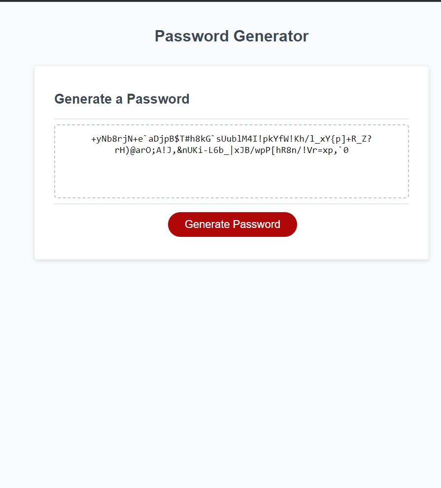

# 03 JavaScript: Random Password Generator

## This is an assignment is made with basic JavaScript and APIs and love ❤️.



## Description

Github:
https://github.com/roflmelon/utor-assignment3

Live Link: https://roflmelon.github.io/utor-assignment3/

## Installation

N/A

## Usage

```
Try all the different types of selections.
It will generate a random password with lengths from 8 to 128.
Will ask for password preferences such as uppercase, lowercase, numbers and special characters.
```

## Contributing

Hao Zhou and friends

## License

[MIT](https://choosealicense.com/licenses/mit/)
